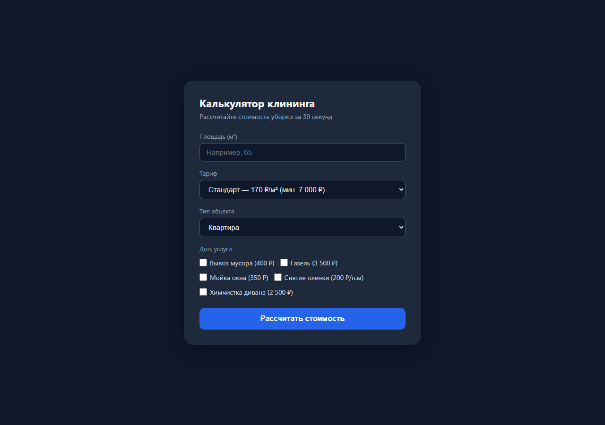

# Чистый Финал — лендинг с чат-ботом-калькулятором и админ-панель

Приложение для клининговой компании **«Чистый Финал»** (Новосибирск): лендинг со встроенным калькулятором стоимости уборки, приём заявок из чат-бота и передача их в админ-панель для персонала.

**Готовое демо (в интернете, открывается с любого компьютера):**
- Лендинг: https://chistyyfinal.netlify.app
- Админ-панель: https://chistyyfinal.netlify.app/admin

---

## Проблема

Менеджер клининговой компании считал стоимость каждой уборки вручную: площадь, тариф, дополнительные услуги, срочность, этажность. Заявки приходили из разных источников (телефон, чат-бот, форма на сайте) и терялись. На расчёт одного заказа уходило несколько минут, на контроль заявок — отдельные таблицы и переписка.

## Пользователь

- **Менеджер компании** — работает в отдельном приложении админ-панели: принимает заявки, рассчитывает точную стоимость, распределяет бригады.
- **Клиент** — видит только публичный лендинг: общается с чат-ботом, получает примерную стоимость и оставляет заявку.

## Основная функция

| Что на входе | Что на выходе |
|---|---|
| Клиент общается с чат-ботом на лендинге: квартира/дом, метраж, дата | Бот считает стоимость в диалоге и сохраняет заявку |
| Заявка из чат-бота (структурированная или текстовым сообщением) | Запись в Netlify Blobs со статусом `new`, видимая менеджеру в админ-панели |
| Действия менеджера в приложении админ-панели | Обновление заявок, назначение бригад, статистика |

## Формат результата

Итог для бизнеса — единая система приёма и обработки заявок вместо ручного расчёта и переписки:
- клиент получает **мгновенную оценку стоимости** в чат-боте и оставляет заявку без звонка;
- заявка **ничего не теряется**: автоматически сохраняется в базе со статусом `new`;
- менеджер видит все заявки в **админ-панели**: рассчитывает точную стоимость, назначает бригаду и дату выезда;
- статистика и архив заявок — в одном месте, без таблиц и разрозненной переписки.

## Технологии

| Слой | Технологии |
|---|---|
| Хостинг | Netlify (статический сайт + serverless-функции) |
| Backend | Netlify Functions (Node.js) |
| База данных | Netlify Blobs (`orders`, `settings`) |
| Frontend | HTML + CSS + Vanilla JS |
| API | REST (JSON) |
| Авторизация | Вход в админ-панель по паролю |

## Минимальный функционал (MVP)

В первой рабочей версии реализовано:
- лендинг с **калькулятором** стоимости уборки;
- **чат-бот** внизу страницы: подбирает тариф по параметрам и принимает заявку;
- **админ-панель**: заявки, каталог услуг/тарифов, бригады, статусы (`new`, отменено, выполнено), архив;
- хранение заявок в Netlify Blobs с автозаполнением базовых данных.

Планируется далее: уведомления менеджеру о новой заявке, онлайн-оплата, экспорт отчётов.

## Скриншоты работающего проекта

**Лендинг с калькулятором и чат-ботом:**


**Калькулятор стоимости:**


**Админ-панель — вход:**


**Админ-панель — заявки:**


**Админ-панель — каталог:**


**Админ-панель — бригады:**


## Структура проекта

```
deploy/                    — статика: лендинг (index.html), админ-панель (admin.html), демо-калькулятор (calc.html)
netlify/functions/         — серверные функции
  webhook-chat.js          — приём заявок из чат-бота (POST)
  orders.js                — чтение/обновление заявок (GET, PATCH)
  data.js                  — тарифы, услуги, бригады (GET, PUT)
netlify.toml               — маршруты /api/* → функции, папка деплоя
scripts/build.js           — заглушка сборки (статика деплоится как есть)
```

## Данные

Хранятся в **Netlify Blobs**:
- store `orders` — заявки клиентов;
- store `settings` — ключи `tariffs`, `services`, `teams`.

При первом обращении автоматически создаются базовые данные: 3 тарифа (Лайт, Стандарт, Премиум), 5 дополнительных услуг и 3 бригады.

## API

### Публичные эндпоинты

| Метод | Путь | Описание |
|---|---|---|
| POST | `/api/webhook/chat` | Приём заявки из чат-бота |

Пример отправки заявки:

```bash
curl -X POST https://chistyyfinal.netlify.app/api/webhook/chat \
  -H "Content-Type: application/json" \
  -d "{\"name\":\"Марина\",\"phone\":\"+7 900 000-00-00\",\"property_type\":\"Квартира\",\"area\":54,\"tariff_id\":2,\"date\":\"2026-08-20\"}"
```

Ожидаемый ответ: `{"ok":true,"order":{...}}` с сохранённой заявкой.

### Эндпоинты админ-панели

| Метод | Путь | Описание |
|---|---|---|
| GET | `/api/orders` | Список всех заявок |
| PATCH | `/api/orders/:id` | Обновление заявки (статус, бригада, сумма) |
| GET | `/api/data` | Каталог: `{ tariffs, services, teams }` |
| PUT | `/api/data` | Сохранение изменённого каталога |

## Вход в админ-панель

Адрес: https://chistyyfinal.netlify.app/admin
Демо-пароль: `admin123` (для проверки).

## Деплой

```bash
# Локальная проверка сайта и функций
netlify dev

# Публикация в продакшн
netlify deploy --prod
```

Статика публикуется из папки `deploy/`, функции берутся из `netlify/functions` (объявлено в `netlify.toml`). Заявки из чат-бота сразу видны в админ-панели — лендинг и админка используют одну базу Netlify Blobs.

## Скилл для Claude Code

В репозитории есть скилл проекта: `.claude/skills/chistyi-final/SKILL.md`. Он описывает, как устроен «Чистый Финал» (лендинг, приложение, админ-панель), API, данные и правила доработки — чтобы ИИ-агент мог развивать проект по инструкции без повторных объяснений.

---

**«Чистый Финал»** — уборка после ремонта «под ключ», Новосибирск.