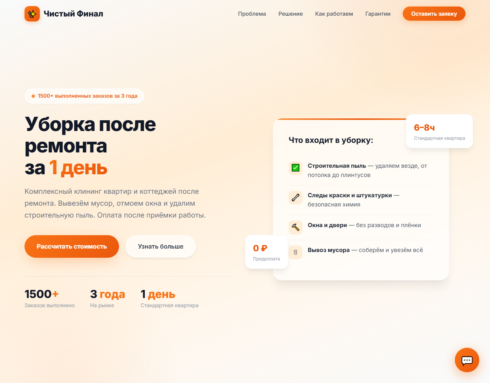
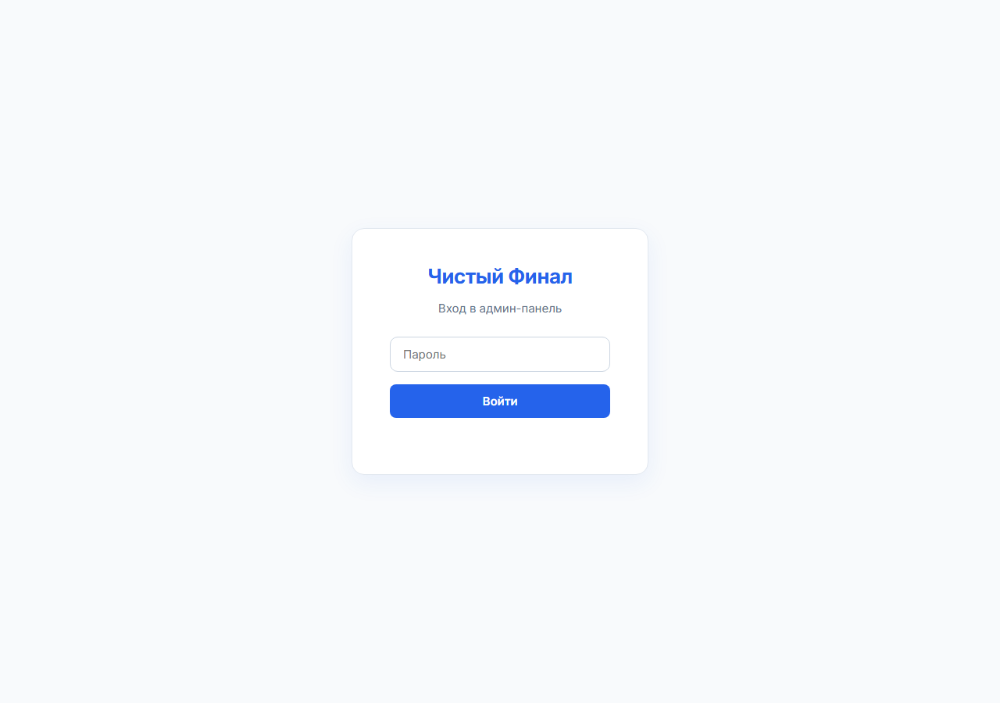
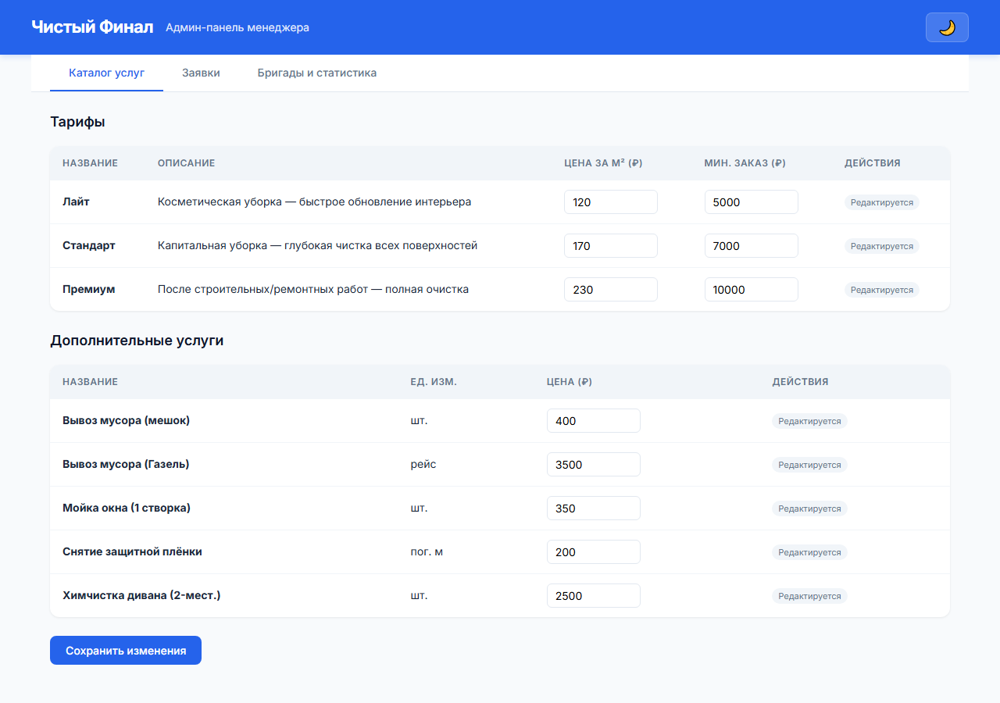
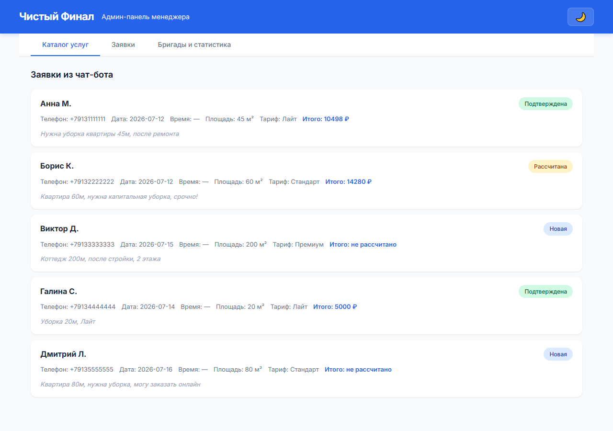
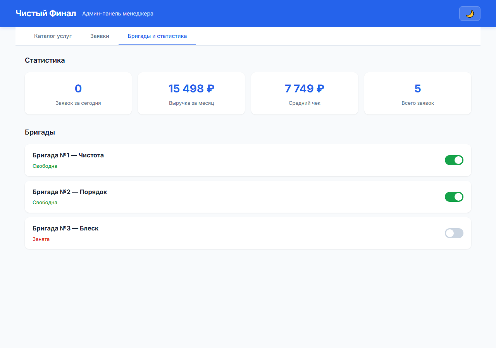

# Чистый Финал — лендинг с чат-ботом-калькулятором и админ-панель

Приложение для клининговой компании **«Чистый Финал»** (Новосибирск): лендинг со встроенным калькулятором стоимости уборки, приём заявок из чат-бота и передача их в админ-панель для персонала.

**Готовое демо (открывается с любого компьютера):**
- Лендинг: https://chistyyfinal.netlify.app
- Админ-панель: https://chistyyfinal.netlify.app/admin

---

## Проблема

Менеджер клининговой компании считал стоимость каждой уборки вручную: площадь, тариф, дополнительные услуги, срочность, этажность. Заявки приходили из разных источников (телефон, чат-бот, форма на сайте) и терялись. На расчёт одного заказа уходило несколько минут, на контроль заявок — отдельные таблицы и переписка.

## Пользователь

- **Менеджер компании** — работает в отдельном приложении админ-панели: принимает заявки, рассчитывает точную стоимость, распределяет бригады.
- **Клиент** — видит только публичный лендинг: общается с чат-ботом, получает примерную стоимость и оставляет заявку.

## Основная функция

| Что на входе | Что на выходе |
|---|---|
| Клиент общается с чат-ботом на лендинге: квартира/дом, метраж, дата | Бот считает стоимость в диалоге и сохраняет заявку |
| Заявка из чат-бота (структурированная или текстовым сообщением) | Запись в БД со статусом `new`, видимая менеджеру в админ-панели |
| Действия менеджера в приложении админ-панели | Обновление заявок, назначение бригад, статистика |

## Технологии

| Слой | Технологии |
|---|---|
| Backend | Node.js + Express |
| База данных | SQLite (sql.js — WASM, без компиляции) |
| Frontend | HTML + CSS + Vanilla JS |
| API | REST (JSON) |
| Авторизация | Вход в админ-панель по паролю |

## Быстрый запуск

```bash
# 1. Установка зависимостей
npm install

# 2. Запуск сервера
npm start
```

Сервер запустится на `http://localhost:3000`:

- **Лендинг** — публичный сайт для клиентов: `http://localhost:3000/`
- **Админ-панель** — отдельное приложение для менеджера: `http://localhost:3000/admin`

Лендинг и админ-панель — два интерфейса одного приложения, связанные общей базой данных:

**Лендинг** — публичная страница для клиентов со встроенным калькулятором: расчёт стоимости выполняется чат-ботом в диалоге. Клиент отвечает боту на вопросы (тип объекта, площадь, дата уборки), бот рассчитывает цену и автоматически сохраняет заявку.

**Админ-панель** — приложение для менеджера: обработка заявок, расчёт точной стоимости, назначение бригад и статистика по заказам.

Вход в админ-панель защищён паролем. Демо-пароль: `admin123` (для проверки).

При первом запуске автоматически создаётся база данных с тестовыми данными: 3 тарифа (Лайт, Стандарт, Премиум), 5 дополнительных услуг, 3 бригады и 5 тестовых заявок.

## API

### Публичные эндпоинты

| Метод | Путь | Описание |
|---|---|---|
| POST | `/api/webhook/chat` | Приём заявки из чат-бота |
| GET | `/api/tariffs` | Список тарифов |
| GET | `/api/services` | Список доп. услуг |
| POST | `/api/calculate` | Расчёт стоимости заказа |

Пример расчёта:

```bash
curl -X POST http://localhost:3000/api/calculate \
  -H "Content-Type: application/json" \
  -d "{\"area\":45,\"tariff_id\":2,\"property_type\":\"Квартира\",\"services\":[{\"service_id\":3,\"quantity\":4},{\"service_id\":1,\"quantity\":5}],\"is_urgent\":false,\"floors_count\":1,\"is_online\":true}"
```

Ожидаемый ответ: `{"total_price": 10498}`

### Админские эндпоинты

| Метод | Путь | Описание |
|---|---|---|
| GET | `/api/admin/orders` | Все заявки |
| GET | `/api/admin/orders/:id` | Детали заявки |
| PATCH | `/api/admin/orders/:id` | Обновление заявки |
| GET | `/api/admin/teams` | Список бригад |
| PATCH | `/api/admin/teams/:id` | Доступность бригады |
| GET | `/api/admin/stats` | Статистика |

## Тесты

```bash
node test-calculator.js
```

Проверяет расчёт стоимости по трём сценариям (включая минимальный заказ и сложный кейс с модификаторами).

## Развёртывание

Полная версия приложения (с сервером и базой данных) работает локально — запускается командой `npm start`.

Разместить её в интернете не удалось: зарубежные хостинги (Render, Railway и др.) из России недоступны или доступ к ним затруднён. Поэтому на Netlify опубликована статическая версия для демонстрации интерфейса: лендинг с работающим чат-ботом-калькулятором и админ-панель на демо-данных. Передача заявок из чат-бота в админ-панель через общую базу данных видна в локальном запуске.

## Скриншоты





**Админ-панель (для менеджера)** — вкладки:







---

**«Чистый Финал»** — уборка после ремонта «под ключ», Новосибирск.
